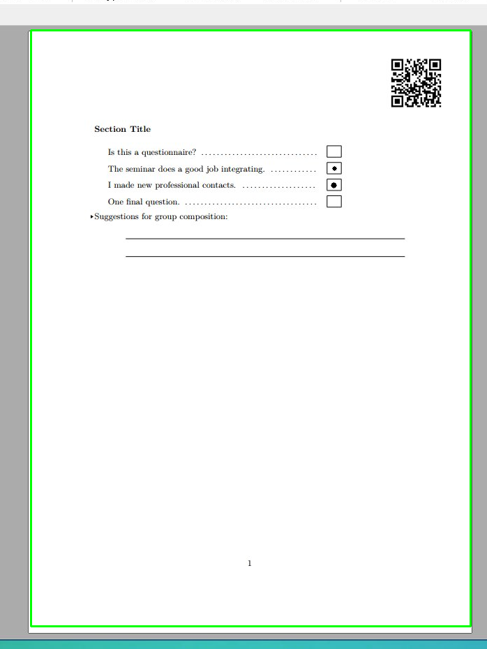
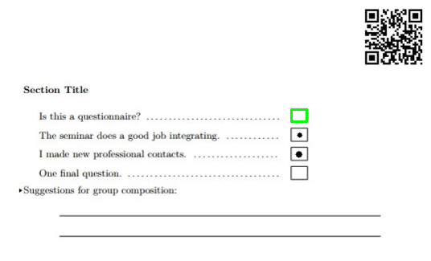

Checkbox Document Scanner
=========================

A prototype document scanner for finding checkboxes and determining which of
them have been checked.


Requirements
------------

This project relies fundamentally on a good QR code detector. The polygon
output for the corner points of the QR code are used to infer the document's
coordinates, which in turn is used to infer checkbox sizes (in pixels, the
sizes in mm must be defined).

Library requirements:
* Python 3
* `numpy~=1.16.2`
* `opencv-python~=4.0`
* `pyzbar~=0.1.8`


QR Code Data
------------

The QR code should encode a url which can be used to fetch a Json object
containing all doc information:

```json
    "page_size": A4_SIZE,
    "checkbox_size": (12, 10),
    "qr_size": (24, 24),
    "qr_offset": = (14, 14),
    "fields": (
        "Is this a questionnaire?",
        "The seminar does a good job integrating.",
        "I made new professional contacts.",
        "One final question."
    ),
```


Results
-------

Inferred document shape from QR code:


Discovered checkbox:


Result:
```
[ ] Is this a questionnaire?
[x] The seminar does a good job integrating.
[x] I made new professional contacts.
[ ] One final question.
```


Resources
---------

https://docs.opencv.org/3.4/da/d6e/tutorial_py_geometric_transformations.html

https://docs.opencv.org/3.4/d7/d4d/tutorial_py_thresholding.html
